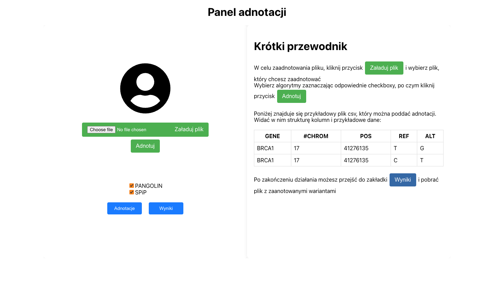

# DNA Sequences Annotator

The aim of the project is to create a platform to support the annotation of splicing variants, 
which will allow for efficient processing and analysis of genetic variants, especially those that
potentially disrupt the splicing process. 
The system is capable of processing SNV type variants for the entire genome, 
using several selected algorithms, and enable online recalculating of INDEL type variants.

One of the key assumptions of this system design is a possibility of an easy integration with existing DNA processing pipelines.

## System architecture

### annotator_ui

A simple graphical interface created in **ReactJS**, which can be used for manual uploading of variants for annotation.

### annotator_core

Contains modules responsible for:
- Handling domain logic
- Providing a REST API interface for DNA sequences processing
- Handling asynchronous communication with workers using **Apache Kafka**
- Storing algorithms results in a persistent database - **PostgreSQL**
- Sending notifications (e.g. email or webhook) when DNA sequences processing is finished

The main component of the system handling the domain logic, which provides a REST API interface.

### annotator_worker

Responsible for efficient processing of genetic data and running DNA sequence annotation algorithms.

### Apache kafka

Stands between the core 
